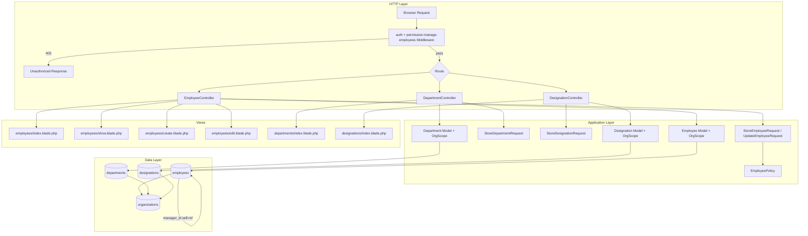

# Design Document: Employee Management

## Overview

Phase 3 of WorkForge SaaS adds a fully org-scoped Employee Management module on top of the existing
single-database multi-tenant foundation (Phase 1: orgs + users) and Spatie RBAC (Phase 2).

The module delivers:
- Three new database tables: `departments`, `designations`, `employees` (with soft deletes and self-referential manager hierarchy)
- Eloquent models with org-scoped global scope, relationships, and query scopes
- Resource controllers for employees, departments, and designations — all gated by `manage-employees` permission
- Blade views using the existing `x-app-layout` component and indigo Tailwind design system
- An `EmployeePolicy` for fine-grained authorization
- Strict org isolation: every query carries a `WHERE org_id = ?` constraint

Tech stack: Laravel 13, Blade, Tailwind CSS, Spatie RBAC (`spatie/laravel-permission ^7.3`),
PHPUnit 12 + Eris for property-based testing.

---

## Architecture



---

## Components and Interfaces

### 1. Migrations

Three migrations in order:

**`create_departments_table`**
```php
Schema::create('departments', function (Blueprint $table) {
    $table->id();
    $table->foreignId('org_id')->constrained('organizations')->cascadeOnDelete();
    $table->string('name');
    $table->timestamps();
    $table->unique(['org_id', 'name']);
    $table->index('org_id');
});
```

**`create_designations_table`**
```php
Schema::create('designations', function (Blueprint $table) {
    $table->id();
    $table->foreignId('org_id')->constrained('organizations')->cascadeOnDelete();
    $table->string('name');
    $table->timestamps();
    $table->unique(['org_id', 'name']);
    $table->index('org_id');
});
```

**`create_employees_table`**
```php
Schema::create('employees', function (Blueprint $table) {
    $table->id();
    $table->foreignId('org_id')->constrained('organizations')->cascadeOnDelete();
    $table->foreignId('user_id')->nullable()->constrained('users')->nullOnDelete();
    $table->string('name');
    $table->string('email');
    $table->string('phone', 20)->nullable();
    $table->foreignId('department_id')->constrained('departments')->restrictOnDelete();
    $table->foreignId('designation_id')->constrained('designations')->restrictOnDelete();
    $table->foreignId('manager_id')->nullable()->constrained('employees')->nullOnDelete();
    $table->date('joining_date');
    $table->enum('status', ['active', 'inactive'])->default('active');
    $table->softDeletes();
    $table->timestamps();
    $table->unique(['org_id', 'email']);
    $table->index('org_id');
    $table->index('department_id');
    $table->index('designation_id');
    $table->index('manager_id');
});
```

> `manager_id` uses `nullOnDelete()` so that soft-deleting a manager automatically nulls out subordinates' `manager_id` at the DB level. The `EmployeeObserver` (see §3) also handles this in application code for soft deletes.

---

### 2. Eloquent Models

#### `OrgScope` — Global Scope

A shared global scope applied to all three models:

```php
// app/Models/Scopes/OrgScope.php
namespace App\Models\Scopes;

use Illuminate\Database\Eloquent\Builder;
use Illuminate\Database\Eloquent\Model;
use Illuminate\Database\Eloquent\Scope;

class OrgScope implements Scope
{
    public function apply(Builder $builder, Model $model): void
    {
        if (auth()->check()) {
            $builder->where($model->getTable() . '.org_id', auth()->user()->org_id);
        }
    }
}
```

#### `Department` Model

```php
// app/Models/Department.php
namespace App\Models;

use App\Models\Scopes\OrgScope;
use Illuminate\Database\Eloquent\Attributes\Fillable;
use Illuminate\Database\Eloquent\Model;
use Illuminate\Database\Eloquent\Relations\HasMany;

#[Fillable(['org_id', 'name'])]
class Department extends Model
{
    protected static function booted(): void
    {
        static::addGlobalScope(new OrgScope());
    }

    public function employees(): HasMany
    {
        return $this->hasMany(Employee::class);
    }
}
```

#### `Designation` Model

```php
// app/Models/Designation.php
namespace App\Models;

use App\Models\Scopes\OrgScope;
use Illuminate\Database\Eloquent\Attributes\Fillable;
use Illuminate\Database\Eloquent\Model;
use Illuminate\Database\Eloquent\Relations\HasMany;

#[Fillable(['org_id', 'name'])]
class Designation extends Model
{
    protected static function booted(): void
    {
        static::addGlobalScope(new OrgScope());
    }

    public function employees(): HasMany
    {
        return $this->hasMany(Employee::class);
    }
}
```

#### `Employee` Model

```php
// app/Models/Employee.php
namespace App\Models;

use App\Models\Scopes\OrgScope;
use Illuminate\Database\Eloquent\Attributes\Fillable;
use Illuminate\Database\Eloquent\Model;
use Illuminate\Database\Eloquent\Relations\BelongsTo;
use Illuminate\Database\Eloquent\Relations\HasMany;
use Illuminate\Database\Eloquent\SoftDeletes;

#[Fillable(['org_id','user_id','name','email','phone','department_id',
            'designation_id','manager_id','joining_date','status'])]
class Employee extends Model
{
    use SoftDeletes;

    protected function casts(): array
    {
        return ['joining_date' => 'date', 'status' => 'string'];
    }

    protected static function booted(): void
    {
        static::addGlobalScope(new OrgScope());
    }

    // Relationships
    public function organization(): BelongsTo
    {
        return $this->belongsTo(Organization::class, 'org_id');
    }

    public function department(): BelongsTo
    {
        return $this->belongsTo(Department::class);
    }

    public function designation(): BelongsTo
    {
        return $this->belongsTo(Designation::class);
    }

    public function manager(): BelongsTo
    {
        return $this->belongsTo(Employee::class, 'manager_id');
    }

    public function subordinates(): HasMany
    {
        return $this->hasMany(Employee::class, 'manager_id');
    }

    public function user(): BelongsTo
    {
        return $this->belongsTo(User::class);
    }

    // Query scopes
    public function scopeActive(Builder $query): Builder
    {
        return $query->where('status', 'active');
    }

    public function scopeSearch(Builder $query, string $term): Builder
    {
        return $query->where(function ($q) use ($term) {
            $q->where('name', 'like', "%{$term}%")
              ->orWhere('email', 'like', "%{$term}%");
        });
    }
}
```

---

### 3. EmployeeObserver

Handles nulling out `manager_id` on subordinates when an employee is soft-deleted (belt-and-suspenders alongside the DB `nullOnDelete`):

```php
// app/Observers/EmployeeObserver.php
class EmployeeObserver
{
    public function deleting(Employee $employee): void
    {
        Employee::withoutGlobalScope(OrgScope::class)
            ->where('manager_id', $employee->id)
            ->update(['manager_id' => null]);
    }
}
```

Register in `AppServiceProvider::boot()`:
```php
Employee::observe(EmployeeObserver::class);
```

---

### 4. Form Request Classes

#### `StoreDepartmentRequest` / `StoreDesignationRequest`

```php
// Shared validation rules for both
public function rules(): array
{
    return [
        'name' => ['required', 'string', 'max:255', 'strip_tags'],
    ];
}

// In StoreDepartmentRequest — unique within org
'name' => [
    'required', 'string', 'max:255',
    Rule::unique('departments')->where('org_id', auth()->user()->org_id),
]

// In UpdateDepartmentRequest — ignore current record
'name' => [
    'required', 'string', 'max:255',
    Rule::unique('departments')->where('org_id', auth()->user()->org_id)->ignore($this->department),
]
```

#### `StoreEmployeeRequest`

```php
public function rules(): array
{
    $orgId = auth()->user()->org_id;
    return [
        'name'           => ['required', 'string', 'max:255'],
        'email'          => ['required', 'email', 'max:255',
                             Rule::unique('employees')->where('org_id', $orgId)],
        'phone'          => ['nullable', 'string', 'max:20'],
        'department_id'  => ['required', 'integer',
                             Rule::exists('departments', 'id')->where('org_id', $orgId)],
        'designation_id' => ['required', 'integer',
                             Rule::exists('designations', 'id')->where('org_id', $orgId)],
        'manager_id'     => ['nullable', 'integer',
                             Rule::exists('employees', 'id')->where('org_id', $orgId)],
        'user_id'        => ['nullable', 'integer',
                             Rule::exists('users', 'id')->where('org_id', $orgId)],
        'joining_date'   => ['required', 'date_format:Y-m-d', 'before_or_equal:today'],
        'status'         => ['nullable', 'in:active,inactive'],
    ];
}
```

#### `UpdateEmployeeRequest`

Same as `StoreEmployeeRequest` with two differences:
1. `email` uniqueness ignores the current employee: `->ignore($this->employee)`
2. Additional custom rule: `manager_id` must not equal the employee's own `id`

```php
public function withValidator(Validator $validator): void
{
    $validator->after(function ($v) {
        if ($this->manager_id && (int) $this->manager_id === $this->employee->id) {
            $v->errors()->add('manager_id', 'An employee cannot be their own manager.');
        }
    });
}
```

---

### 5. Controllers

#### `DepartmentController`

```php
// app/Http/Controllers/DepartmentController.php
class DepartmentController extends Controller
{
    public function index(): View                                    // list all org departments
    public function create(): View                                   // show create form
    public function store(StoreDepartmentRequest $r): RedirectResponse  // persist + redirect
    public function edit(Department $department): View              // show edit form
    public function update(UpdateDepartmentRequest $r, Department $department): RedirectResponse
    public function destroy(Department $department): RedirectResponse   // delete if no employees
}
```

`destroy()` pseudocode:
```php
public function destroy(Department $department): RedirectResponse
{
    if ($department->employees()->exists()) {
        return back()->withErrors(['department' => 'Cannot delete: employees are assigned to this department.']);
    }
    $department->delete();
    return redirect()->route('departments.index')->with('success', 'Department deleted.');
}
```

#### `DesignationController`

Identical structure to `DepartmentController` but operates on `Designation` model.

#### `EmployeeController`

```php
// app/Http/Controllers/EmployeeController.php
class EmployeeController extends Controller
{
    public function index(Request $request): View
    // Applies search, department_id, status filters; eager-loads department+designation
    // Paginates at 20; passes departments list for filter dropdown

    public function show(Employee $employee): View
    // Loads employee with manager, department, designation relationships

    public function create(): View
    // Passes departments, designations, active employees (for manager dropdown) to view

    public function store(StoreEmployeeRequest $request): RedirectResponse
    // Sets org_id from auth user; persists; redirects to index with success

    public function edit(Employee $employee): View
    // Passes employee + dropdowns; manager list excludes $employee->id

    public function update(UpdateEmployeeRequest $request, Employee $employee): RedirectResponse
    // Updates record; redirects to show with success

    public function destroy(Employee $employee): RedirectResponse
    // Soft-deletes; observer nulls subordinates' manager_id; redirects to index
}
```

`index()` pseudocode:
```php
public function index(Request $request): View
{
    $query = Employee::with(['department', 'designation'])
        ->orderBy('name');

    if ($request->filled('search')) {
        $query->search($request->search);
    }
    if ($request->filled('department_id')) {
        $query->where('department_id', $request->department_id);
    }
    if ($request->filled('status') && in_array($request->status, ['active', 'inactive'])) {
        $query->where('status', $request->status);
    }

    $employees   = $query->paginate(20)->withQueryString();
    $departments = Department::orderBy('name')->get();

    return view('employees.index', compact('employees', 'departments'));
}
```

`store()` pseudocode:
```php
public function store(StoreEmployeeRequest $request): RedirectResponse
{
    Employee::create(array_merge(
        $request->validated(),
        ['org_id' => auth()->user()->org_id]
    ));
    return redirect()->route('employees.index')->with('success', 'Employee created.');
}
```

---

### 6. EmployeePolicy

```php
// app/Policies/EmployeePolicy.php
namespace App\Policies;

use App\Models\Employee;
use App\Models\User;

class EmployeePolicy
{
    public function viewAny(User $user): bool  { return true; }
    public function view(User $user, Employee $employee): bool { return true; }

    public function create(User $user): bool
    {
        return $user->hasPermissionTo('manage-employees');
    }

    public function update(User $user, Employee $employee): bool
    {
        return $user->hasPermissionTo('manage-employees')
            && $user->org_id === $employee->org_id;
    }

    public function delete(User $user, Employee $employee): bool
    {
        return $this->update($user, $employee);
    }
}
```

Register in `AppServiceProvider`:
```php
Gate::policy(Employee::class, EmployeePolicy::class);
```

---

### 7. Route Structure

```php
// routes/web.php — added under auth middleware group
Route::middleware(['auth', 'verified'])->group(function () {

    // Employee directory + profile — all authenticated users
    Route::get('/employees', [EmployeeController::class, 'index'])->name('employees.index');
    Route::get('/employees/{employee}', [EmployeeController::class, 'show'])->name('employees.show');

    // Employee CRUD — manage-employees permission required
    Route::middleware('permission:manage-employees')->group(function () {
        Route::get('/employees/create', [EmployeeController::class, 'create'])->name('employees.create');
        Route::post('/employees', [EmployeeController::class, 'store'])->name('employees.store');
        Route::get('/employees/{employee}/edit', [EmployeeController::class, 'edit'])->name('employees.edit');
        Route::put('/employees/{employee}', [EmployeeController::class, 'update'])->name('employees.update');
        Route::delete('/employees/{employee}', [EmployeeController::class, 'destroy'])->name('employees.destroy');

        // Departments
        Route::resource('departments', DepartmentController::class)->except(['show']);

        // Designations
        Route::resource('designations', DesignationController::class)->except(['show']);
    });
});
```

> Route model binding for `Employee` will automatically apply the `OrgScope` global scope, so a user requesting `/employees/99` where employee 99 belongs to a different org will receive a 404.

---

### 8. Blade Views Structure

```
resources/views/
├── employees/
│   ├── index.blade.php       # directory with filter bar + table
│   ├── show.blade.php        # employee profile
│   ├── create.blade.php      # create form
│   └── edit.blade.php        # edit form (pre-populated)
├── departments/
│   ├── index.blade.php       # list + inline create/edit links
│   ├── create.blade.php
│   └── edit.blade.php
├── designations/
│   ├── index.blade.php
│   ├── create.blade.php
│   └── edit.blade.php
└── components/
    └── status-badge.blade.php   # reusable status badge component
```

#### `status-badge` Component

```blade
{{-- resources/views/components/status-badge.blade.php --}}
@props(['status'])
@php
    $classes = $status === 'active'
        ? 'bg-green-100 text-green-800'
        : 'bg-red-100 text-red-800';
@endphp
<span {{ $attributes->merge(['class' => "inline-flex items-center px-2.5 py-0.5 rounded-full text-xs font-medium $classes"]) }}>
    {{ ucfirst($status) }}
</span>
```

Usage: `<x-status-badge :status="$employee->status" />`

#### Employee Directory (`employees/index.blade.php`) — key sections

```blade
<x-app-layout>
    {{-- Filter bar --}}
    <form method="GET" action="{{ route('employees.index') }}" class="flex gap-3 flex-wrap mb-6">
        <input type="text" name="search" value="{{ request('search') }}"
               placeholder="Search name or email…"
               class="border-gray-300 rounded-md shadow-sm focus:ring-indigo-500 focus:border-indigo-500" />

        <select name="department_id" class="border-gray-300 rounded-md shadow-sm focus:ring-indigo-500">
            <option value="">All Departments</option>
            @foreach ($departments as $dept)
                <option value="{{ $dept->id }}" @selected(request('department_id') == $dept->id)>
                    {{ $dept->name }}
                </option>
            @endforeach
        </select>

        <select name="status" class="border-gray-300 rounded-md shadow-sm focus:ring-indigo-500">
            <option value="">All Statuses</option>
            <option value="active"   @selected(request('status') === 'active')>Active</option>
            <option value="inactive" @selected(request('status') === 'inactive')>Inactive</option>
        </select>

        <button type="submit" class="bg-indigo-600 text-white px-4 py-2 rounded-md hover:bg-indigo-700">
            Filter
        </button>

        @can('create', App\Models\Employee::class)
            <a href="{{ route('employees.create') }}"
               class="ml-auto bg-indigo-600 text-white px-4 py-2 rounded-md hover:bg-indigo-700">
                Add Employee
            </a>
        @endcan
    </form>

    {{-- Table --}}
    <table class="min-w-full divide-y divide-gray-200">
        <thead class="bg-gray-50">
            <tr>
                <th>Name</th><th>Email</th><th>Department</th><th>Designation</th><th>Status</th>
                @can('create', App\Models\Employee::class)<th>Actions</th>@endcan
            </tr>
        </thead>
        <tbody>
            @foreach ($employees as $employee)
            <tr>
                <td><a href="{{ route('employees.show', $employee) }}" class="text-indigo-600 hover:underline">{{ $employee->name }}</a></td>
                <td>{{ $employee->email }}</td>
                <td>{{ $employee->department->name }}</td>
                <td>{{ $employee->designation->name }}</td>
                <td><x-status-badge :status="$employee->status" /></td>
                @can('update', $employee)
                <td>
                    <a href="{{ route('employees.edit', $employee) }}">Edit</a>
                    <form method="POST" action="{{ route('employees.destroy', $employee) }}" class="inline">
                        @csrf @method('DELETE')
                        <button type="submit" onclick="return confirm('Delete?')">Delete</button>
                    </form>
                </td>
                @endcan
            </tr>
            @endforeach
        </tbody>
    </table>
    {{ $employees->links() }}
</x-app-layout>
```

---

## Data Models

### ER Diagram

```mermaid
erDiagram
    organizations {
        bigint id PK
        string name
    }
    departments {
        bigint id PK
        bigint org_id FK
        string name
    }
    designations {
        bigint id PK
        bigint org_id FK
        string name
    }
    employees {
        bigint id PK
        bigint org_id FK
        bigint user_id FK "nullable"
        string name
        string email
        string phone "nullable"
        bigint department_id FK
        bigint designation_id FK
        bigint manager_id FK "nullable self-ref"
        date joining_date
        enum status "active|inactive"
        timestamp deleted_at "nullable"
        timestamps
    }
    users {
        bigint id PK
        bigint org_id FK
        string name
        string email
        string role
    }

    organizations ||--o{ departments : "has"
    organizations ||--o{ designations : "has"
    organizations ||--o{ employees : "has"
    organizations ||--o{ users : "has"
    departments ||--o{ employees : "assigned to"
    designations ||--o{ employees : "assigned to"
    employees ||--o{ employees : "manages (manager_id)"
    users ||--o| employees : "linked to"
```

### Unique Constraints Summary

| Table | Constraint |
|---|---|
| `departments` | `UNIQUE(org_id, name)` |
| `designations` | `UNIQUE(org_id, name)` |
| `employees` | `UNIQUE(org_id, email)` |

### Indexes Summary

| Table | Index Columns |
|---|---|
| `departments` | `org_id` |
| `designations` | `org_id` |
| `employees` | `org_id`, `department_id`, `designation_id`, `manager_id` |

### Org Scoping Strategy

All three models boot the `OrgScope` global scope. This means:

- `Employee::all()` → `SELECT * FROM employees WHERE org_id = ? AND deleted_at IS NULL`
- `Department::find(1)` → `SELECT * FROM departments WHERE id = 1 AND org_id = ?`
- Route model binding automatically applies the scope, so a mismatched `org_id` yields a 404

To bypass the scope (e.g., in the observer or seeder): `Employee::withoutGlobalScope(OrgScope::class)`.

The `org_id` is never accepted from user input — it is always set from `auth()->user()->org_id` in the controller before persistence.

---

## Correctness Properties

*A property is a characteristic or behavior that should hold true across all valid executions of a system — essentially, a formal statement about what the system should do. Properties serve as the bridge between human-readable specifications and machine-verifiable correctness guarantees.*

### Property 1: Org Isolation — Query Results

*For any* two organizations A and B with distinct employee/department/designation records, any query executed against the `employees`, `departments`, or `designations` tables while authenticated as a user of org A should return only records whose `org_id` equals A's id — no records from org B should appear.

**Validates: Requirements 4.1**

---

### Property 2: Org Isolation — 404 on Cross-Org Access

*For any* authenticated user and any employee/department/designation record whose `org_id` does not match the user's `org_id`, a request to view, edit, or delete that record should return an HTTP 404 response.

**Validates: Requirements 4.2**

---

### Property 3: Auto-Set org_id on Create

*For any* create operation on employees, departments, or designations, the persisted record's `org_id` should equal the authenticated user's `org_id`, regardless of any `org_id` value supplied in the request body.

**Validates: Requirements 4.4**

---

### Property 4: Unique Name Within Org (Departments and Designations)

*For any* organization, attempting to create a second department (or designation) with the same name as an existing one in that org should fail with a validation error; the same name in a different org should succeed.

**Validates: Requirements 1.4, 2.4**

---

### Property 5: Prevent Deletion When Employees Assigned

*For any* department or designation that has at least one employee assigned to it, a delete request should be rejected with an error message and the record should remain in the database.

**Validates: Requirements 1.3, 2.3**

---

### Property 6: Permission Gate — 403 for Unauthorized Mutations

*For any* authenticated user who does not hold the `manage-employees` permission, any request to create, edit, or delete an employee, department, or designation should return an HTTP 403 response.

**Validates: Requirements 5.4, 6.4, 7.4**

---

### Property 7: Employee Required Field Validation

*For any* employee create or update request where any required field (`name`, `email`, `department_id`, `designation_id`, `joining_date`) is missing, empty, or invalid, the system should reject the request and redirect back with validation errors and the previously submitted input preserved.

**Validates: Requirements 7.2, 16.3**

---

### Property 8: Employee Email Uniqueness Within Org

*For any* org, attempting to create or update an employee with an email address already used by another employee in the same org should fail with a validation error. On update, the employee's own current email should not trigger this error.

**Validates: Requirements 3.3, 7.2, 10.2**

---

### Property 9: Manager Cannot Be Self

*For any* employee update request where `manager_id` equals the employee's own `id`, the system should reject the request with a validation error.

**Validates: Requirements 10.4**

---

### Property 10: Manager Must Belong to Same Org

*For any* employee create or update request where `manager_id` references an employee in a different org, the system should reject the request with a validation error.

**Validates: Requirements 7.5, 12.4**

---

### Property 11: Employee Directory Filters

*For any* combination of `search`, `department_id`, and `status` filter parameters, every employee returned in the directory should satisfy all active filter conditions simultaneously, and no soft-deleted employees should appear.

**Validates: Requirements 8.1, 8.2, 8.3, 8.4, 11.2**

---

### Property 12: Soft Delete Nulls Subordinate manager_id

*For any* employee who is assigned as `manager_id` on one or more other employees, soft-deleting that employee should set `manager_id` to `null` on all subordinate employee records.

**Validates: Requirements 11.4**

---

### Property 13: Manager Dropdown Excludes Self

*For any* employee being edited, the manager dropdown rendered in the edit form should not contain that employee's own record.

**Validates: Requirements 12.3**

---

### Property 14: Action Controls Visibility

*For any* authenticated user without the `manage-employees` permission, the rendered employee directory and profile pages should not contain create, edit, or delete action controls.

**Validates: Requirements 8.6, 9.4**

---

### Property 15: Form Dropdowns Are Org-Scoped

*For any* employee create or edit form, the `department_id`, `designation_id`, and `manager_id` select inputs should contain only records belonging to the authenticated user's org.

**Validates: Requirements 14.4, 14.5, 14.6**

---

### Property 16: Joining Date Validation

*For any* employee create or update request where `joining_date` is not a valid `Y-m-d` calendar date or is in the future, the system should reject the request with a validation error.

**Validates: Requirements 16.4**

---

### Property 17: Status Badge Rendering

*For any* employee with `status = 'active'`, the rendered status badge should carry green CSS classes; for `status = 'inactive'`, it should carry red CSS classes.

**Validates: Requirements 13.3**

---

## Error Handling

| Scenario | Handling |
|---|---|
| Cross-org record access | `OrgScope` + route model binding → 404 |
| `manage-employees` permission missing | Spatie `PermissionMiddleware` → 403 |
| Department/designation delete with employees | Controller checks `->employees()->exists()` → redirect back with error |
| Unique name violation (dept/designation) | Form Request validation → redirect back with `errors` bag |
| Employee email duplicate within org | Form Request `Rule::unique` → redirect back with `errors` bag |
| `manager_id` = self | `UpdateEmployeeRequest::withValidator` custom rule → redirect back with error |
| `manager_id` from different org | `Rule::exists` scoped to `org_id` → redirect back with error |
| Invalid `joining_date` format | `date_format:Y-m-d` rule → redirect back with error |
| Future `joining_date` | `before_or_equal:today` rule → redirect back with error |
| HTML in name/email/phone | `strip_tags` sanitization in Form Request `prepareForValidation()` |
| Soft-deleted employee accessed directly | `SoftDeletes` + `OrgScope` → 404 |

### Flash Messages

All controllers use `->with('success', '...')` on successful operations. Views display flash messages via:

```blade
@if (session('success'))
    <div class="bg-green-100 border border-green-400 text-green-700 px-4 py-3 rounded mb-4">
        {{ session('success') }}
    </div>
@endif
@if ($errors->any())
    <div class="bg-red-100 border border-red-400 text-red-700 px-4 py-3 rounded mb-4">
        <ul>@foreach ($errors->all() as $e)<li>{{ $e }}</li>@endforeach</ul>
    </div>
@endif
```

---

## Testing Strategy

### Dual Testing Approach

Both unit/feature tests and property-based tests are required. They are complementary:
- Feature tests verify specific flows, edge cases, and HTTP responses
- Property tests verify universal invariants across randomly generated inputs

### Unit / Feature Tests (PHPUnit)

Focus on concrete examples and integration points:

- `DepartmentControllerTest`: store/update/destroy happy paths; 403 for non-admin; 422 for duplicate name; error when deleting dept with employees
- `DesignationControllerTest`: same structure as above
- `EmployeeControllerTest`: index with each filter; show; store; update; destroy; 403 for non-admin; 404 for cross-org access
- `EmployeeObserverTest`: assert subordinates' `manager_id` is nulled after soft delete
- `EmployeePolicyTest`: assert `create`/`update`/`delete` return correct bool for various user/employee combinations
- `StoreEmployeeRequestTest`: assert each required field triggers validation; assert optional fields pass when valid
- `UpdateEmployeeRequestTest`: assert self-manager rule fires; assert email uniqueness ignores self

### Property-Based Tests (Eris)

Use `giorgiosironi/eris` (already in `require-dev`). Each test runs minimum 100 iterations.

Tag format: `Feature: employee-management, Property {N}: {property_text}`

**Property 1 — Org Isolation**
```php
// Feature: employee-management, Property 1: Org isolation — query results
// Generate two orgs with random employees each.
// Authenticate as org A user. Assert Employee::all() contains only org A employees.
```

**Property 2 — 404 on Cross-Org Access**
```php
// Feature: employee-management, Property 2: 404 on cross-org access
// Generate random employee in org B. Authenticate as org A user.
// Assert GET /employees/{id} returns 404.
```

**Property 3 — Auto-Set org_id**
```php
// Feature: employee-management, Property 3: Auto-set org_id on create
// Generate random valid employee payload (without org_id or with wrong org_id).
// POST as org A admin. Assert created employee->org_id === org A id.
```

**Property 4 — Unique Name Within Org**
```php
// Feature: employee-management, Property 4: Unique name within org
// Generate random department name. Create it in org A. Attempt to create again in org A.
// Assert second attempt fails. Create same name in org B. Assert it succeeds.
```

**Property 5 — Prevent Deletion With Employees**
```php
// Feature: employee-management, Property 5: Prevent deletion when employees assigned
// Generate random department with 1+ employees. Attempt DELETE. Assert redirect with error.
// Assert department still exists.
```

**Property 6 — 403 for Unauthorized Mutations**
```php
// Feature: employee-management, Property 6: 403 for unauthorized mutations
// For any of [store, update, destroy] routes on employees/departments/designations,
// authenticate as user without manage-employees. Assert 403.
```

**Property 7 — Required Field Validation**
```php
// Feature: employee-management, Property 7: Employee required field validation
// Generate employee payloads with one required field missing or invalid.
// Assert POST /employees redirects back with errors bag containing that field.
// Assert old input is preserved in session.
```

**Property 8 — Email Uniqueness Within Org**
```php
// Feature: employee-management, Property 8: Employee email uniqueness within org
// Generate random email. Create employee with it in org A. Attempt to create another
// with same email in org A. Assert validation error. Same email in org B should succeed.
// On update, assert employee's own email does not trigger uniqueness error.
```

**Property 9 — Manager Cannot Be Self**
```php
// Feature: employee-management, Property 9: Manager cannot be self
// For any employee, submit update with manager_id = employee->id.
// Assert validation error on manager_id field.
```

**Property 10 — Manager Must Belong to Same Org**
```php
// Feature: employee-management, Property 10: Manager must belong to same org
// Generate manager employee in org B. Submit employee create/update in org A
// with manager_id pointing to org B employee. Assert validation error.
```

**Property 11 — Directory Filters**
```php
// Feature: employee-management, Property 11: Employee directory filters
// Generate random employees across departments and statuses.
// For any combination of search/department_id/status filters, assert all returned
// employees satisfy all active filter conditions and none are soft-deleted.
```

**Property 12 — Soft Delete Nulls Subordinates**
```php
// Feature: employee-management, Property 12: Soft delete nulls subordinate manager_id
// Generate manager with random number of subordinates. Soft-delete manager.
// Assert all former subordinates have manager_id = null.
```

**Property 13 — Manager Dropdown Excludes Self**
```php
// Feature: employee-management, Property 13: Manager dropdown excludes self
// For any employee, render edit form. Assert employee's own id does not appear
// in the manager_id select options.
```

**Property 14 — Action Controls Visibility**
```php
// Feature: employee-management, Property 14: Action controls visibility
// For any user without manage-employees, render employees.index and employees.show.
// Assert rendered HTML does not contain links/buttons for create, edit, or delete.
```

**Property 15 — Form Dropdowns Are Org-Scoped**
```php
// Feature: employee-management, Property 15: Form dropdowns are org-scoped
// Generate departments/designations/employees in org A and org B.
// Render create form as org A user. Assert all select options belong to org A only.
```

**Property 16 — Joining Date Validation**
```php
// Feature: employee-management, Property 16: Joining date validation
// Generate invalid date strings (wrong format, future dates, non-dates).
// Assert each fails validation. Generate valid past Y-m-d dates. Assert each passes.
```

**Property 17 — Status Badge Rendering**
```php
// Feature: employee-management, Property 17: Status badge rendering
// For any employee with status='active', assert rendered badge contains 'green' class.
// For status='inactive', assert rendered badge contains 'red' class.
```
