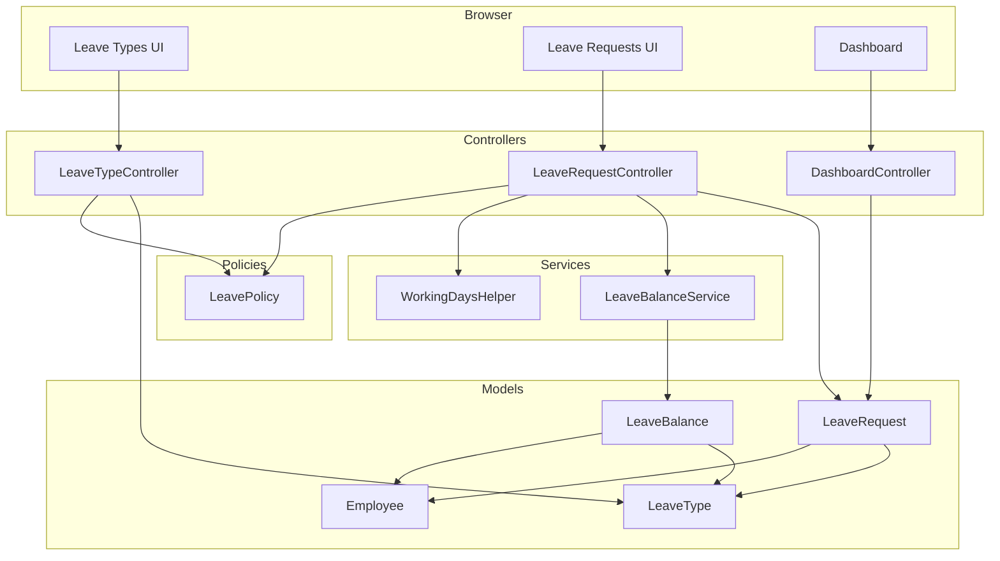

# Design Document: Leave Management

## Overview

Leave Management is Phase 4 of WorkForge SaaS. It adds three capabilities on top of the existing multi-tenant Laravel 13 / Blade / Tailwind stack:

1. **Leave Type Management** — Admins define leave categories (e.g. Casual, Sick, Paid) with annual day limits.
2. **Leave Application & Approval** — Employees apply; Managers/Admins approve or reject.
3. **Balance Tracking** — The system automatically tracks used days per employee per leave type per year.

All data is isolated by `org_id` via the existing `OrgScope` global scope. The feature reuses the existing Spatie RBAC permissions (`manage-employees`, `approve-leave`, `apply-leave`) already seeded in `RoleAndPermissionSeeder`.

### Component Diagram



---

## Architecture

The feature follows the same layered architecture used by employee management:

- **Routes** → **Policy/Permission middleware** → **Controller** → **Model / Service** → **Blade view**
- `OrgScope` is applied as a global scope on all three new models, so every Eloquent query is automatically tenant-isolated.
- `LeaveBalanceService` encapsulates balance mutation logic, keeping controllers thin.
- `WorkingDaysHelper` is a pure static helper with no dependencies, making it trivially testable.
- `DashboardController::leaveCount()` already exists and queries `leave_requests` via raw DB; once the migration runs it returns real data with no code change needed.

---

## Components and Interfaces

### WorkingDaysHelper

```php
// app/Helpers/WorkingDaysHelper.php
class WorkingDaysHelper
{
    /**
     * Count weekdays (Mon–Fri) between two dates, inclusive.
     * Returns 0 if $start > $end.
     */
    public static function count(Carbon $start, Carbon $end): int
    {
        if ($start->gt($end)) return 0;

        $days = 0;
        $current = $start->copy();
        while ($current->lte($end)) {
            if (!$current->isWeekend()) {
                $days++;
            }
            $current->addDay();
        }
        return $days;
    }
}
```

### LeaveBalanceService

```php
// app/Services/LeaveBalanceService.php
class LeaveBalanceService
{
    /**
     * Get or initialize a balance record (used_days defaults to 0).
     */
    public function getOrInit(int $orgId, int $employeeId, int $leaveTypeId, int $year): LeaveBalance;

    /**
     * Increment used_days by $days. Called on approval.
     */
    public function increment(int $orgId, int $employeeId, int $leaveTypeId, int $year, int $days): void;

    /**
     * Decrement used_days by $days. Called on reversal (approved → rejected).
     * Clamps to 0 to prevent negative values.
     */
    public function decrement(int $orgId, int $employeeId, int $leaveTypeId, int $year, int $days): void;

    /**
     * Check if employee has sufficient balance.
     * Returns true if used_days + $requestedDays <= max_days.
     */
    public function hasSufficientBalance(int $orgId, int $employeeId, LeaveType $leaveType, int $year, int $requestedDays): bool;
}
```

### LeaveTypeController

```php
// app/Http/Controllers/LeaveTypeController.php
// Middleware: auth, verified, permission:manage-employees

public function index(): View          // list all leave types for org
public function create(): View         // show create form
public function store(StoreLeaveTypeRequest $request): RedirectResponse
public function edit(LeaveType $leaveType): View
public function update(UpdateLeaveTypeRequest $request, LeaveType $leaveType): RedirectResponse
public function destroy(LeaveType $leaveType): RedirectResponse
    // Guard: if $leaveType->leaveRequests()->exists() → back()->withErrors(...)
```

### LeaveRequestController

```php
// app/Http/Controllers/LeaveRequestController.php
// Middleware: auth, verified

public function index(): View
    // Employee: own requests only (where employee_id = auth employee)
    // Manager/Admin: all requests in org

public function create(): View
    // Permission: apply-leave
    // Passes $leaveTypes and employee's current balances to view

public function store(StoreLeaveRequestRequest $request): RedirectResponse
    // Permission: apply-leave
    // 1. Resolve employee record for auth user
    // 2. Compute total_days via WorkingDaysHelper
    // 3. Check balance via LeaveBalanceService::hasSufficientBalance()
    // 4. Create LeaveRequest with status=pending

public function approve(LeaveRequest $leaveRequest): RedirectResponse
    // Permission: approve-leave
    // Guard: status must be pending
    // 1. Update status=approved, reviewed_by, reviewed_at
    // 2. LeaveBalanceService::increment()

public function reject(Request $request, LeaveRequest $leaveRequest): RedirectResponse
    // Permission: approve-leave
    // Guard: status must be pending
    // 1. Update status=rejected, reviewed_by, reviewed_at, rejection_reason
    // 2. If previous status was approved: LeaveBalanceService::decrement()
```

### LeavePolicy

```php
// app/Policies/LeavePolicy.php
public function apply(User $user): bool
    // return $user->hasPermissionTo('apply-leave')

public function approve(User $user): bool
    // return $user->hasPermissionTo('approve-leave')
```

---

## Data Models

### ER Diagram

```mermaid
erDiagram
    organizations ||--o{ leave_types : "has"
    organizations ||--o{ leave_requests : "has"
    organizations ||--o{ leave_balances : "has"
    employees ||--o{ leave_requests : "submits"
    employees ||--o{ leave_balances : "has"
    leave_types ||--o{ leave_requests : "categorizes"
    leave_types ||--o{ leave_balances : "tracks"
    users ||--o{ leave_requests : "reviews"

    leave_types {
        bigint id PK
        bigint org_id FK
        string name
        int max_days
        timestamps
    }

    leave_requests {
        bigint id PK
        bigint org_id FK
        bigint employee_id FK
        bigint leave_type_id FK
        date start_date
        date end_date
        int total_days
        string reason
        enum status
        bigint reviewed_by FK
        timestamp reviewed_at
        text rejection_reason
        timestamps
    }

    leave_balances {
        bigint id PK
        bigint org_id FK
        bigint employee_id FK
        bigint leave_type_id FK
        int year
        int used_days
        timestamps
        unique org_employee_type_year
    }
```

### Migration: leave_types

```php
Schema::create('leave_types', function (Blueprint $table) {
    $table->id();
    $table->foreignId('org_id')->constrained('organizations')->cascadeOnDelete();
    $table->string('name');
    $table->unsignedInteger('max_days');
    $table->timestamps();
    $table->unique(['org_id', 'name']);
    $table->index('org_id');
});
```

### Migration: leave_requests

```php
Schema::create('leave_requests', function (Blueprint $table) {
    $table->id();
    $table->foreignId('org_id')->constrained('organizations')->cascadeOnDelete();
    $table->foreignId('employee_id')->constrained('employees')->cascadeOnDelete();
    $table->foreignId('leave_type_id')->constrained('leave_types')->restrictOnDelete();
    $table->date('start_date');
    $table->date('end_date');
    $table->unsignedInteger('total_days');
    $table->text('reason');
    $table->enum('status', ['pending', 'approved', 'rejected'])->default('pending');
    $table->foreignId('reviewed_by')->nullable()->constrained('users')->nullOnDelete();
    $table->timestamp('reviewed_at')->nullable();
    $table->text('rejection_reason')->nullable();
    $table->timestamps();
    $table->index('org_id');
    $table->index(['org_id', 'status']);
    $table->index('employee_id');
    $table->index('leave_type_id');
});
```

### Migration: leave_balances

```php
Schema::create('leave_balances', function (Blueprint $table) {
    $table->id();
    $table->foreignId('org_id')->constrained('organizations')->cascadeOnDelete();
    $table->foreignId('employee_id')->constrained('employees')->cascadeOnDelete();
    $table->foreignId('leave_type_id')->constrained('leave_types')->cascadeOnDelete();
    $table->unsignedSmallInteger('year');
    $table->unsignedInteger('used_days')->default(0);
    $table->timestamps();
    $table->unique(['org_id', 'employee_id', 'leave_type_id', 'year'], 'leave_balances_unique');
    $table->index('org_id');
    $table->index('employee_id');
});
```

### Eloquent Models

All three models apply `OrgScope` in `booted()`, matching the pattern in `Employee`:

```php
// LeaveType
#[Fillable(['org_id', 'name', 'max_days'])]
class LeaveType extends Model
{
    protected static function booted(): void
    {
        static::addGlobalScope(new OrgScope());
    }

    public function leaveRequests(): HasMany
    {
        return $this->hasMany(LeaveRequest::class);
    }
}

// LeaveRequest
#[Fillable(['org_id', 'employee_id', 'leave_type_id', 'start_date', 'end_date',
            'total_days', 'reason', 'status', 'reviewed_by', 'reviewed_at', 'rejection_reason'])]
class LeaveRequest extends Model
{
    protected static function booted(): void
    {
        static::addGlobalScope(new OrgScope());
    }

    protected function casts(): array
    {
        return [
            'start_date'  => 'date',
            'end_date'    => 'date',
            'reviewed_at' => 'datetime',
        ];
    }

    public function employee(): BelongsTo { return $this->belongsTo(Employee::class); }
    public function leaveType(): BelongsTo { return $this->belongsTo(LeaveType::class); }
    public function reviewer(): BelongsTo { return $this->belongsTo(User::class, 'reviewed_by'); }
}

// LeaveBalance
#[Fillable(['org_id', 'employee_id', 'leave_type_id', 'year', 'used_days'])]
class LeaveBalance extends Model
{
    protected static function booted(): void
    {
        static::addGlobalScope(new OrgScope());
    }

    public function employee(): BelongsTo { return $this->belongsTo(Employee::class); }
    public function leaveType(): BelongsTo { return $this->belongsTo(LeaveType::class); }
}
```

### Form Requests

**StoreLeaveTypeRequest**
```php
'name'     => ['required', 'string', 'max:100', Rule::unique('leave_types')->where('org_id', auth()->user()->org_id)],
'max_days' => ['required', 'integer', 'min:1'],
```

**StoreLeaveRequestRequest**
```php
'leave_type_id' => ['required', 'integer', 'exists:leave_types,id'],
'start_date'    => ['required', 'date'],
'end_date'      => ['required', 'date', 'gte:start_date'],
'reason'        => ['required', 'string', 'max:500'],
```

### Route Structure

```php
// routes/web.php — inside middleware(['auth', 'verified']) group

// Leave Types — Admin only
Route::middleware('permission:manage-employees')->group(function () {
    Route::resource('leave-types', LeaveTypeController::class)->except(['show']);
});

// Leave Requests
Route::get('/leave-requests', [LeaveRequestController::class, 'index'])->name('leave-requests.index');

Route::middleware('permission:apply-leave')->group(function () {
    Route::get('/leave-requests/create', [LeaveRequestController::class, 'create'])->name('leave-requests.create');
    Route::post('/leave-requests', [LeaveRequestController::class, 'store'])->name('leave-requests.store');
});

Route::middleware('permission:approve-leave')->group(function () {
    Route::post('/leave-requests/{leaveRequest}/approve', [LeaveRequestController::class, 'approve'])->name('leave-requests.approve');
    Route::post('/leave-requests/{leaveRequest}/reject',  [LeaveRequestController::class, 'reject'])->name('leave-requests.reject');
});
```

### Blade Views

```
resources/views/
  leave-types/
    index.blade.php     — table of leave types, edit/delete buttons (Admin only)
    create.blade.php    — name + max_days form
    edit.blade.php      — pre-filled name + max_days form
  leave-requests/
    index.blade.php     — table with status badges; approve/reject buttons for Manager/Admin
    create.blade.php    — leave type select, date pickers, reason textarea, balance hint
```

The existing `<x-status-badge>` component is reused for `pending` / `approved` / `rejected` badges.

Approve and reject actions are inline `<form>` POST buttons on the index view (no separate page needed). The reject form includes a `rejection_reason` textarea rendered in a small modal or inline collapsible.

### Dashboard Integration

`DashboardController::leaveCount()` already queries `leave_requests` via `DB::table()` with `org_id` and `status` filters. Once the migration runs, it returns real data automatically — no code change required.

The employee dashboard (`employee.dashboard` view) will receive leave counts from `DashboardController::employee()`:

```php
public function employee(): View
{
    $employee = Employee::where('user_id', auth()->id())->firstOrFail();
    $counts = LeaveRequest::where('employee_id', $employee->id)
        ->selectRaw('status, count(*) as total')
        ->groupBy('status')
        ->pluck('total', 'status');

    return view('employee.dashboard', compact('counts'));
}
```

### DefaultDataSeeder Addition

```php
// Inside DefaultDataSeeder::run(), after departments/designations seeding:
$leaveTypes = [
    ['name' => 'Casual Leave', 'max_days' => 12],
    ['name' => 'Sick Leave',   'max_days' => 10],
    ['name' => 'Paid Leave',   'max_days' => 15],
];

foreach ($leaveTypes as $lt) {
    \App\Models\LeaveType::firstOrCreate(
        ['org_id' => $org->id, 'name' => $lt['name']],
        ['max_days' => $lt['max_days']]
    );
}
```

---

## Correctness Properties

*A property is a characteristic or behavior that should hold true across all valid executions of a system — essentially, a formal statement about what the system should do. Properties serve as the bridge between human-readable specifications and machine-verifiable correctness guarantees.*

### Property 1: OrgScope isolation

*For any* authenticated user, all queries on `leave_types`, `leave_requests`, and `leave_balances` must return only records whose `org_id` matches the user's `org_id`, regardless of what other records exist in the database.

**Validates: Requirements 1.1, 3.5, 5.6, 6.5, 7.1**

---

### Property 2: Leave type create round-trip

*For any* valid leave type name and positive integer `max_days`, creating a leave type and then querying it back must return a record with the same name, `max_days`, and the creating admin's `org_id`.

**Validates: Requirements 1.2**

---

### Property 3: Leave type update round-trip

*For any* existing leave type and valid update data, updating the record and then reading it back must reflect the new values.

**Validates: Requirements 1.3**

---

### Property 4: Leave type delete when no requests

*For any* leave type with no associated leave requests, deleting it must result in the record no longer existing in the database.

**Validates: Requirements 1.4**

---

### Property 5: Leave type delete blocked when requests exist

*For any* leave type that has one or more associated leave requests, attempting deletion must leave the record intact and return an error.

**Validates: Requirements 1.5**

---

### Property 6: Leave type validation rejects invalid input

*For any* input where the leave type name is blank or `max_days` is not a positive integer, the system must return a validation error and must not persist any new record.

**Validates: Requirements 1.6**

---

### Property 7: Permission enforcement returns 403

*For any* user lacking the required permission (`manage-employees`, `apply-leave`, or `approve-leave`), attempting the corresponding action must return an HTTP 403 response and must not modify any data.

**Validates: Requirements 1.7, 2.6, 3.4**

---

### Property 8: Leave request create round-trip with pending status

*For any* valid leave application submitted by an employee, the created `LeaveRequest` record must have `status = pending` and `org_id` equal to the employee's `org_id`.

**Validates: Requirements 2.1**

---

### Property 9: Working days calculation

*For any* pair of dates where `start_date <= end_date`, `WorkingDaysHelper::count()` must return exactly the number of Monday–Friday days in that range, inclusive. The result must always be a positive integer for any range containing at least one weekday.

**Validates: Requirements 2.2, 7.3**

---

### Property 10: Date range validation

*For any* leave application where `start_date` is strictly after `end_date`, the system must return a validation error and must not persist a `LeaveRequest`.

**Validates: Requirements 2.3**

---

### Property 11: Balance enforcement prevents over-limit requests

*For any* employee whose `used_days + requested_total_days > max_days` for a given leave type and year, the system must reject the application with an insufficient-balance error and must not persist the `LeaveRequest`.

**Validates: Requirements 2.4**

---

### Property 12: Cross-org references return 404

*For any* request that references a `leave_type_id` or `employee_id` belonging to a different `org_id` than the authenticated user, the system must return an HTTP 404 response.

**Validates: Requirements 2.5, 7.2**

---

### Property 13: Employee cannot apply on behalf of another

*For any* leave application submission, the `employee_id` stored on the created `LeaveRequest` must always equal the `id` of the `Employee` record linked to the authenticated user, regardless of any `employee_id` value present in the request payload.

**Validates: Requirements 2.7**

---

### Property 14: Review sets correct fields

*For any* pending `LeaveRequest`, approving it must set `status = approved`, `reviewed_by = reviewer_user_id`, and `reviewed_at` to a non-null timestamp. Rejecting it must additionally set `rejection_reason` to the provided value and `status = rejected`.

**Validates: Requirements 3.1, 3.2**

---

### Property 15: Non-pending requests cannot be actioned

*For any* `LeaveRequest` whose `status` is `approved` or `rejected`, attempting to approve or reject it must return an error and must not modify the record.

**Validates: Requirements 3.3**

---

### Property 16: Balance increment on approval

*For any* approved `LeaveRequest` with `total_days = N`, the employee's `LeaveBalance.used_days` for the corresponding leave type and year must increase by exactly `N` after approval.

**Validates: Requirements 4.1**

---

### Property 17: Balance decrement on reversal (approve → reject round-trip)

*For any* `LeaveRequest` that is first approved and then rejected, the employee's `LeaveBalance.used_days` must return to the value it held before the approval.

**Validates: Requirements 4.2**

---

### Property 18: Balance initialization at zero

*For any* new combination of `(employee_id, leave_type_id, year)` that has no existing `LeaveBalance` record, `LeaveBalanceService::getOrInit()` must return a record with `used_days = 0`.

**Validates: Requirements 4.3**

---

### Property 19: Available days invariant

*For any* `LeaveBalance` record, the computed available days must always equal `max_days - used_days`, where `max_days` comes from the associated `LeaveType`.

**Validates: Requirements 4.5**

---

### Property 20: Leave history scoping by role

*For any* employee user, the leave history index must contain only that employee's own requests. *For any* manager or admin user, the leave history index must contain all requests within their `org_id` and no requests from other organizations.

**Validates: Requirements 5.1, 5.2, 5.6**

---

### Property 21: Dashboard counts match actual request counts

*For any* organization with a known set of leave requests, the dashboard leave counts for `pending`, `approved`, and `rejected` must exactly match the actual counts of records with those statuses scoped to that `org_id`. For an employee, the counts must match only their own requests.

**Validates: Requirements 6.1, 6.2, 6.3, 6.4**

---

### Property 22: Status enum enforcement

*For any* persisted `LeaveRequest`, the `status` field must be one of `pending`, `approved`, or `rejected`. Any attempt to set an invalid status value must be rejected.

**Validates: Requirements 7.5**

---

## Error Handling

| Scenario | Response |
|---|---|
| Leave type name blank or `max_days` < 1 | Redirect back with `$errors` bag |
| Delete leave type with existing requests | Redirect back with named error `leave_type` |
| `start_date` > `end_date` | Validation error on `end_date` |
| Insufficient leave balance | Redirect back with error `leave_type_id` |
| Cross-org `leave_type_id` / `employee_id` | 404 (OrgScope causes model not found) |
| Action on non-pending request | Redirect back with error `status` |
| Missing permission | 403 via Spatie middleware |
| `total_days` computed as 0 (all-weekend range) | Validation error: "Selected dates contain no working days" |

---

## Testing Strategy

### Dual Testing Approach

Both unit/feature tests and property-based tests are required. They are complementary:

- **Feature tests** (PHPUnit + Laravel's `RefreshDatabase`): verify specific HTTP flows, edge cases, and integration between layers.
- **Property-based tests** (using [Eris](https://github.com/giorgiosironi/eris) for PHP): verify universal properties across randomly generated inputs.

### Unit / Feature Tests

Focus areas:
- `WorkingDaysHelper::count()` — specific date examples including all-weekend ranges, single days, cross-month ranges.
- `LeaveBalanceService` — increment, decrement, getOrInit with known values.
- `LeaveTypeController` — CRUD HTTP flows, 403 for non-admin, 422 for invalid input.
- `LeaveRequestController` — apply flow, approve/reject flow, cross-org 404, non-pending guard.
- `LeavePolicy` — unit test `apply()` and `approve()` with users of different roles.
- `DefaultDataSeeder` — verify three leave types are created for the demo org.

### Property-Based Tests

Use **Eris** (`composer require --dev giorgiosironi/eris`). Each test runs a minimum of **100 iterations**.

Each test must be tagged with a comment in this format:
`// Feature: leave-management, Property N: <property_text>`

| Property | Test description |
|---|---|
| P1 | Generate two orgs with leave types; query as user from org A; assert no org B records returned |
| P2 | Generate random valid name + max_days; create; read back; assert fields match |
| P3 | Generate leave type; generate random update data; update; read back; assert new values |
| P4 | Generate leave type with no requests; delete; assert not found |
| P5 | Generate leave type with 1+ requests; attempt delete; assert record still exists |
| P6 | Generate blank names and non-positive max_days; assert no record created |
| P7 | Generate users without required permissions; attempt protected actions; assert 403 |
| P8 | Generate valid leave application data; submit; assert status=pending and correct org_id |
| P9 | Generate random date pairs (start <= end); assert count equals manual weekday count |
| P10 | Generate date pairs where start > end; assert validation error, no record created |
| P11 | Generate employee near balance limit; request days that exceed limit; assert rejection |
| P12 | Generate cross-org leave_type_id; submit application; assert 404 |
| P13 | Submit application with arbitrary employee_id in payload; assert stored employee_id = auth employee |
| P14 | Generate pending request; approve/reject; assert all review fields set correctly |
| P15 | Generate approved/rejected request; attempt approve/reject; assert record unchanged |
| P16 | Generate pending request with N days; approve; assert used_days increased by N |
| P17 | Generate pending request; approve then reject; assert used_days = original value |
| P18 | Generate new employee/type/year combo; call getOrInit; assert used_days = 0 |
| P19 | Generate balance records; assert available_days = max_days - used_days always |
| P20 | Generate org with multiple employees; query as employee; assert only own requests returned |
| P21 | Generate org with known request counts per status; assert dashboard counts match |
| P22 | Attempt to set invalid status values; assert rejection |
