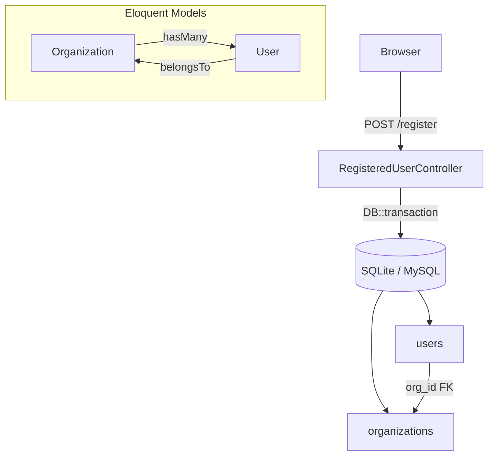
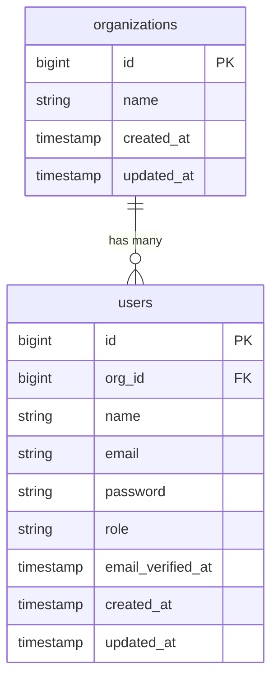

# Design: Multi-Tenant Organization

## Overview

This feature introduces single-database multi-tenancy to the Laravel 13 / Breeze application. Every user belongs to exactly one organization. Registration creates an organization and its first admin user atomically. All tenant-scoped resources are filtered by `org_id` at the application layer, with referential integrity enforced at the database layer via foreign key constraints and cascade deletes.

The approach is deliberately minimal: one new `organizations` table, two new columns on `users`, one new Eloquent model, and targeted changes to the registration controller and view.

---

## Architecture



**Tenancy model:** shared database, shared schema. Every query on tenant-scoped resources must include a `WHERE org_id = ?` clause, applied via Eloquent global scopes or explicit `where('org_id', ...)` calls.

---

## Components and Interfaces

### 1. Migration: `create_organizations_table`

Creates the `organizations` table before the users migration runs (or as a standalone migration that runs first).

```php
// Signature
Schema::create('organizations', function (Blueprint $table) {
    $table->id();
    $table->string('name');
    $table->timestamps();
});
```

### 2. Migration: `add_org_id_and_role_to_users_table`

Adds `org_id` (NOT NULL FK) and `role` (string, default `'admin'`) to the existing `users` table.

```php
// Signature
Schema::table('users', function (Blueprint $table) {
    $table->foreignId('org_id')->constrained('organizations')->cascadeOnDelete();
    $table->string('role')->default('admin');
});
```

### 3. Eloquent Model: `Organization`

```php
namespace App\Models;

class Organization extends Model
{
    // Relationships
    public function users(): HasMany  // hasMany(User::class)

    // Fillable: ['name']
}
```

### 4. Eloquent Model: `User` (updated)

```php
// New relationship
public function organization(): BelongsTo  // belongsTo(Organization::class, 'org_id')

// Updated #[Fillable] attribute adds: 'org_id', 'role'
```

### 5. `RegisteredUserController::store` (updated)

```php
// Pseudocode
public function store(Request $request): RedirectResponse
{
    $request->validate([
        'company_name' => ['required', 'string', 'max:255'],
        'name'         => ['required', 'string', 'max:255'],
        'email'        => ['required', 'string', 'lowercase', 'email', 'max:255', 'unique:users'],
        'password'     => ['required', 'confirmed', Password::defaults()],
    ]);

    $user = DB::transaction(function () use ($request) {
        $org = Organization::create(['name' => $request->company_name]);

        return User::create([
            'name'     => $request->name,
            'email'    => $request->email,
            'password' => Hash::make($request->password),
            'org_id'   => $org->id,
            'role'     => 'admin',
        ]);
    });

    event(new Registered($user));
    Auth::login($user);

    return redirect(route('dashboard', absolute: false));
}
```

### 6. Blade View: `register.blade.php` (updated)

A `company_name` input field is added as the first field in the form, above the existing `name` field, using the same Breeze component pattern:

```blade
<!-- Company Name -->
<div>
    <x-input-label for="company_name" :value="__('Company Name')" />
    <x-text-input id="company_name" class="block mt-1 w-full" type="text"
        name="company_name" :value="old('company_name')" required autofocus />
    <x-input-error :messages="$errors->get('company_name')" class="mt-2" />
</div>
```

---

## Data Models

### `organizations` table

| Column       | Type         | Constraints          |
|--------------|--------------|----------------------|
| `id`         | bigint       | PK, auto-increment   |
| `name`       | varchar(255) | NOT NULL             |
| `created_at` | timestamp    | nullable             |
| `updated_at` | timestamp    | nullable             |

### `users` table (additions)

| Column   | Type         | Constraints                                      |
|----------|--------------|--------------------------------------------------|
| `org_id` | bigint       | NOT NULL, FK → `organizations.id` CASCADE DELETE |
| `role`   | varchar(255) | NOT NULL, default `'admin'`                      |

### Entity Relationship



### Tenant Scoping Contract

Every query on a tenant-scoped resource MUST include `org_id` filtering. The canonical pattern:

```php
// In controllers / services — always scope to authenticated user's org
$items = SomeModel::where('org_id', Auth::user()->org_id)->get();
```

For models that are always tenant-scoped, a global scope is preferred:

```php
// In the model's booted() method
protected static function booted(): void
{
    if (Auth::check()) {
        static::addGlobalScope('org', fn ($q) => $q->where('org_id', Auth::id()));
    }
}
```

`Organization` and `User` themselves are not globally scoped — they are the root tenant models.

---

## Correctness Properties

*A property is a characteristic or behavior that should hold true across all valid executions of a system — essentially, a formal statement about what the system should do. Properties serve as the bridge between human-readable specifications and machine-verifiable correctness guarantees.*

### Property 1: Company name validation rejects invalid input

*For any* registration request where `company_name` is empty, null, or composed entirely of whitespace, the system should reject the request with a validation error and create neither an `Organization` nor a `User` record.

**Validates: Requirements 1.1, 3.2**

---

### Property 2: Registration round-trip — user is linked to its organization

*For any* valid registration payload, after the registration completes, the created `User`'s `org_id` must equal the `id` of the `Organization` created during the same request, and `org_id` must be non-null.

**Validates: Requirements 1.2, 1.5**

---

### Property 3: Transaction atomicity — all-or-nothing creation

*For any* registration attempt where organization creation succeeds but user creation fails (e.g., duplicate email), neither the `Organization` nor the `User` record should be persisted to the database.

**Validates: Requirements 1.3**

---

### Property 4: New registrant always receives the admin role

*For any* successful registration, the created `User` record must have `role = 'admin'`.

**Validates: Requirements 1.4**

---

### Property 5: Tenant scoping prevents cross-organization data leakage

*For any* two distinct organizations A and B, a query for tenant-scoped resources scoped to organization A must never return records belonging to organization B.

**Validates: Requirements 2.1**

---

### Property 6: Cascade delete removes all organization users

*For any* organization with one or more associated users, deleting the organization must result in all of its users being deleted, leaving no orphaned `users` rows with a dangling `org_id`.

**Validates: Requirements 2.2**

---

## Error Handling

| Scenario | Handling |
|---|---|
| `company_name` missing or blank | Laravel validation returns 422 with field error; no DB writes |
| Duplicate email on registration | Validation rejects before transaction; no org created |
| DB failure mid-transaction | `DB::transaction` rolls back; exception propagates to Laravel's exception handler; user sees 500 or custom error page |
| `org_id` FK violation (manual insert without org) | DB raises integrity constraint error; caught as `QueryException` |
| Organization deleted while user is logged in | Session remains valid until next request; subsequent authenticated queries will fail FK lookup — application should handle `ModelNotFoundException` gracefully |

---

## Testing Strategy

### Dual Testing Approach

Both unit/feature tests and property-based tests are required. They are complementary:

- **Feature tests** (PHPUnit + Laravel's `RefreshDatabase`): verify specific registration flows, HTTP responses, and database state for concrete examples.
- **Property-based tests** (using [Eris](https://github.com/giorgiosironi/eris) for PHP): verify universal properties across randomly generated inputs.

### Feature Tests (PHPUnit)

Located in `tests/Feature/Auth/RegistrationTest.php` (extend existing file):

- Example: successful registration creates org + user with correct `org_id` and `role='admin'`
- Example: registration with empty `company_name` returns validation error
- Example: registration with duplicate email returns validation error, no org created
- Example: register form renders `company_name` input field
- Edge case: `company_name` of exactly 255 characters is accepted; 256 characters is rejected
- Edge case: whitespace-only `company_name` is rejected

### Property-Based Tests (Eris)

Each property test must run a minimum of **100 iterations**.

Tag format: `Feature: multi-tenant-organization, Property {N}: {property_text}`

| Property | Test description |
|---|---|
| P1 | Generate arbitrary blank/whitespace `company_name` strings → assert validation error, assert 0 orgs and 0 users created |
| P2 | Generate valid registration payloads → assert `user.org_id == organization.id` and `user.org_id != null` |
| P3 | Simulate user creation failure (duplicate email injection) → assert org count unchanged after failed attempt |
| P4 | Generate valid registration payloads → assert all created users have `role == 'admin'` |
| P5 | Generate N orgs each with M resources → assert scoped query for org A returns exactly org A's resources |
| P6 | Generate org with random number of users → delete org → assert `users` table has no rows with that `org_id` |

### Unit Tests

- `Organization::users()` returns a `HasMany` relation
- `User::organization()` returns a `BelongsTo` relation
- `User` fillable includes `org_id` and `role`
