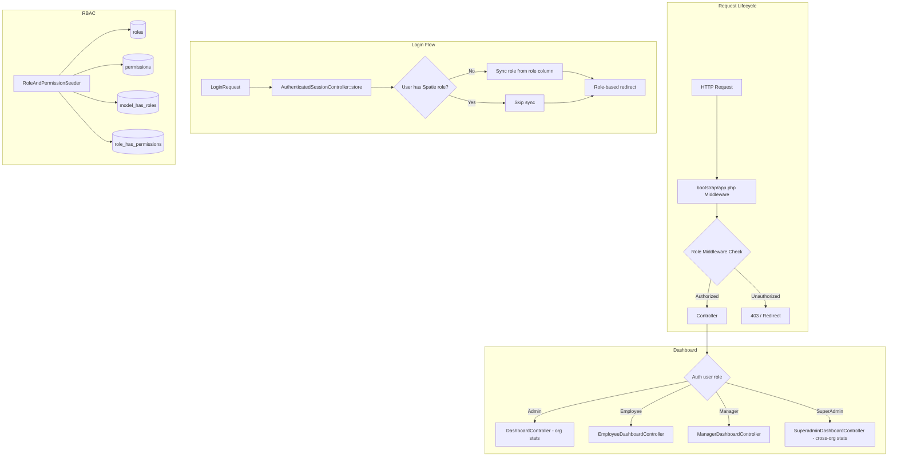
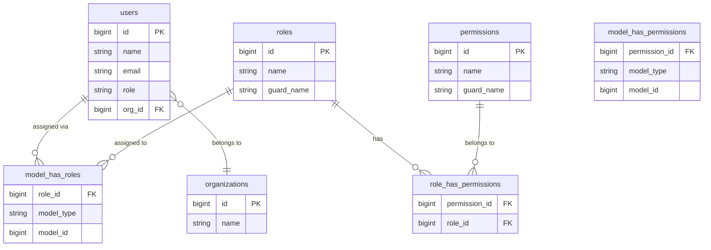

# Design Document: Roles and Dashboard

## Overview

This document describes the technical design for Phase 2 of WorkForge SaaS: a formal Role & Permission System backed by `spatie/laravel-permission`, role-based post-login redirects, an org-scoped Admin Dashboard, and a platform-level Superadmin Dashboard.

Phase 1 established single-database multi-tenancy with a plain `role` string column (`admin`, `member`, `superadmin`, `manager`) on the `users` table and an `org_id` foreign key. Phase 2 migrates that string-based role into Spatie's RBAC model while keeping the `role` column as the source of truth for seeding and login-time sync. Org-scoping is handled via `org_id` on the `User` model — Spatie's `teams` feature is not used.

---

## Architecture



---

## Components and Interfaces

### 1. Spatie Package Installation

Install via Composer and publish assets:

```bash
composer require spatie/laravel-permission
php artisan vendor:publish --provider="Spatie\Permission\PermissionServiceProvider"
php artisan migrate
```

The published config lives at `config/permission.php`. The key setting:

```php
// config/permission.php
'teams' => false,
'cache' => [
    'expiration_time' => \DateInterval::createFromDateString('24 hours'),
    'key' => 'spatie.permission.cache',
    'store' => 'default',
],
```

### 2. User Model

Add the `HasRoles` trait alongside existing traits:

```php
use Spatie\Permission\Traits\HasRoles;

class User extends Authenticatable
{
    use HasFactory, Notifiable, HasRoles;
    // existing code unchanged
}
```

### 3. RoleAndPermissionSeeder

**File:** `database/seeders/RoleAndPermissionSeeder.php`

**Responsibilities:**
- Create roles and permissions idempotently via `firstOrCreate`
- Assign permissions to roles
- Sync existing users from `role` column to Spatie roles

**Role-to-permission mapping:**

| Role       | Permissions                              |
|------------|------------------------------------------|
| SuperAdmin | `*` (all permissions)                    |
| Admin      | `manage-employees`, `approve-leave`      |
| Manager    | `approve-leave`                          |
| Employee   | `apply-leave`                            |

**String role → Spatie role mapping:**

| `users.role` string | Spatie Role |
|---------------------|-------------|
| `superadmin`        | `SuperAdmin` |
| `admin`             | `Admin`      |
| `manager`           | `Manager`    |
| `member`            | `Employee`   |

**Method signatures:**

```php
class RoleAndPermissionSeeder extends Seeder
{
    public function run(): void
    {
        app()[\Spatie\Permission\PermissionRegistrar::class]->forgetCachedPermissions();

        // Create permissions
        $manageEmployees = Permission::firstOrCreate(['name' => 'manage-employees']);
        $approveLeave    = Permission::firstOrCreate(['name' => 'approve-leave']);
        $applyLeave      = Permission::firstOrCreate(['name' => 'apply-leave']);

        // Create roles and assign permissions
        $superAdmin = Role::firstOrCreate(['name' => 'SuperAdmin']);
        $admin      = Role::firstOrCreate(['name' => 'Admin']);
        $manager    = Role::firstOrCreate(['name' => 'Manager']);
        $employee   = Role::firstOrCreate(['name' => 'Employee']);

        $superAdmin->syncPermissions(Permission::all());
        $admin->syncPermissions([$manageEmployees, $approveLeave]);
        $manager->syncPermissions([$approveLeave]);
        $employee->syncPermissions([$applyLeave]);

        // Sync existing users
        $this->syncExistingUsers();
    }

    private function syncExistingUsers(): void
    {
        $map = [
            'superadmin' => 'SuperAdmin',
            'admin'      => 'Admin',
            'manager'    => 'Manager',
            'member'     => 'Employee',
        ];

        User::all()->each(function (User $user) use ($map) {
            $spatieName = $map[$user->role] ?? null;
            if ($spatieName === null) {
                Log::warning("RoleAndPermissionSeeder: unknown role '{$user->role}' for user {$user->id}, skipping.");
                return;
            }
            if (!$user->hasRole($spatieName)) {
                $user->assignRole($spatieName);
            }
        });
    }
}
```

### 4. AuthenticatedSessionController

**File:** `app/Http/Controllers/Auth/AuthenticatedSessionController.php`

**Changes to `store()`:**
1. After `$request->authenticate()` and session regeneration, call `syncSpatieRole($user)`.
2. Determine redirect destination based on Spatie role.

```php
public function store(LoginRequest $request): RedirectResponse
{
    $request->authenticate();
    $request->session()->regenerate();

    $user = Auth::user();
    $this->syncSpatieRole($user);

    return redirect($this->redirectForRole($user));
}

private function syncSpatieRole(User $user): void
{
    if ($user->roles()->exists()) {
        return; // already has a Spatie role, skip
    }

    $map = [
        'superadmin' => 'SuperAdmin',
        'admin'      => 'Admin',
        'manager'    => 'Manager',
        'member'     => 'Employee',
    ];

    $spatieName = $map[$user->role] ?? null;
    if ($spatieName) {
        $user->assignRole($spatieName);
    }
}

private function redirectForRole(User $user): string
{
    return match (true) {
        $user->role === 'superadmin'  => '/superadmin/dashboard',
        $user->hasRole('Admin')       => '/dashboard',
        $user->hasRole('Manager')     => '/manager/dashboard',
        $user->hasRole('Employee')    => '/employee/dashboard',
        default                       => '/dashboard',
    };
}
```

### 5. Middleware Registration

**File:** `bootstrap/app.php` (Laravel 13 style)

```php
->withMiddleware(function (Middleware $middleware): void {
    $middleware->alias([
        'role'       => \Spatie\Permission\Middleware\RoleMiddleware::class,
        'permission' => \Spatie\Permission\Middleware\PermissionMiddleware::class,
        'role_or_permission' => \Spatie\Permission\Middleware\RoleOrPermissionMiddleware::class,
    ]);
})
```

### 6. Route Structure

**File:** `routes/web.php`

```php
// Admin dashboard
Route::get('/dashboard', [DashboardController::class, 'index'])
    ->middleware(['auth', 'verified', 'role:Admin|SuperAdmin'])
    ->name('dashboard');

// Employee dashboard
Route::get('/employee/dashboard', [DashboardController::class, 'employee'])
    ->middleware(['auth', 'role:Employee'])
    ->name('employee.dashboard');

// Manager dashboard
Route::get('/manager/dashboard', [DashboardController::class, 'manager'])
    ->middleware(['auth', 'role:Manager'])
    ->name('manager.dashboard');

// Superadmin dashboard
Route::get('/superadmin/dashboard', [DashboardController::class, 'superadmin'])
    ->middleware(['auth', 'role:SuperAdmin'])
    ->name('superadmin.dashboard');
```

Unauthorized access returns a 403 response. A custom exception handler in `bootstrap/app.php` can redirect to the user's own dashboard instead of showing a raw error page:

```php
->withExceptions(function (Exceptions $exceptions): void {
    $exceptions->render(function (\Spatie\Permission\Exceptions\UnauthorizedException $e, Request $request) {
        if ($request->expectsJson()) {
            return response()->json(['message' => 'Unauthorized.'], 403);
        }
        return redirect()->route('dashboard')->with('error', 'Access denied.');
    });
})
```

### 7. DashboardController

**File:** `app/Http/Controllers/DashboardController.php`

The controller handles all four dashboard routes. Leave request counts use a safe fallback (zero) when the `leave_requests` table does not yet exist.

```php
class DashboardController extends Controller
{
    public function index(): View
    {
        $user  = Auth::user();
        $orgId = $user->org_id;

        $stats = [
            'total_employees'  => User::where('org_id', $orgId)->count(),
            'pending_leaves'   => $this->leaveCount($orgId, 'pending'),
            'approved_leaves'  => $this->leaveCount($orgId, 'approved'),
            'rejected_leaves'  => $this->leaveCount($orgId, 'rejected'),
        ];

        return view('dashboard', compact('stats'));
    }

    public function employee(): View
    {
        return view('employee.dashboard');
    }

    public function manager(): View
    {
        return view('manager.dashboard');
    }

    public function superadmin(): View
    {
        $stats = [
            'total_organizations' => Organization::count(),
            'total_users'         => User::count(),
        ];

        return view('superadmin.dashboard', compact('stats'));
    }

    private function leaveCount(int $orgId, string $status): int
    {
        if (!Schema::hasTable('leave_requests')) {
            return 0;
        }

        return DB::table('leave_requests')
            ->where('org_id', $orgId)
            ->where('status', $status)
            ->count();
    }
}
```

### 8. UserPolicy

**File:** `app/Policies/UserPolicy.php`

```php
class UserPolicy
{
    public function manageEmployees(User $authUser, User $targetUser): bool
    {
        return $authUser->hasPermissionTo('manage-employees')
            && $authUser->org_id === $targetUser->org_id;
    }

    public function create(User $authUser): bool
    {
        return $authUser->hasPermissionTo('manage-employees');
    }

    public function update(User $authUser, User $targetUser): bool
    {
        return $this->manageEmployees($authUser, $targetUser);
    }

    public function delete(User $authUser, User $targetUser): bool
    {
        return $this->manageEmployees($authUser, $targetUser);
    }
}
```

Laravel's auto-discovery will register this policy automatically (matching `User` model to `UserPolicy`). No manual registration in `AppServiceProvider` is required for Laravel 13.

---

## Data Models

### Spatie Standard Tables



No new migrations are needed beyond Spatie's published migration. The existing `users.role` string column is retained as the source of truth for seeding and login-time sync.

### Dashboard View Data

**Admin dashboard** (`/dashboard`) receives:

```php
[
    'total_employees' => int,   // User::where('org_id', $orgId)->count()
    'pending_leaves'  => int,   // 0 if table missing
    'approved_leaves' => int,   // 0 if table missing
    'rejected_leaves' => int,   // 0 if table missing
]
```

**Superadmin dashboard** (`/superadmin/dashboard`) receives:

```php
[
    'total_organizations' => int,  // Organization::count()
    'total_users'         => int,  // User::count()
]
```

---

## Correctness Properties

*A property is a characteristic or behavior that should hold true across all valid executions of a system — essentially, a formal statement about what the system should do. Properties serve as the bridge between human-readable specifications and machine-verifiable correctness guarantees.*

### Property 1: Seeder Idempotence

*For any* initial database state, running `RoleAndPermissionSeeder` two or more times should produce exactly the same set of roles, permissions, and user-role assignments as running it once — no duplicates are created.

**Validates: Requirements 2.7, 3.3**

---

### Property 2: User Role Mapping

*For any* user whose `role` column contains a known string value (`superadmin`, `admin`, `manager`, `member`), after `RoleAndPermissionSeeder` runs that user should have exactly one Spatie role assigned, and that role should be the one specified by the mapping table.

**Validates: Requirements 3.1**

---

### Property 3: Login-Time Role Sync

*For any* user who has no Spatie roles assigned, after a successful login that user should have exactly the Spatie role corresponding to their `role` column value. *For any* user who already has a Spatie role assigned, after a successful login their role assignments should be unchanged.

**Validates: Requirements 4.2, 4.3**

---

### Property 4: Route Access Control

*For any* authenticated user and any dashboard route (`/dashboard`, `/employee/dashboard`, `/manager/dashboard`, `/superadmin/dashboard`), the user should receive a 200 response if and only if they hold the role required by that route; all other users should receive a 403 or redirect response.

**Validates: Requirements 5.2, 5.3, 5.4, 5.5, 5.6, 10.2**

---

### Property 5: Role-Based Login Redirect

*For any* authenticated user, the post-login redirect destination should be exactly the dashboard URL that corresponds to their Spatie role (or `role` string for superadmin), with `/dashboard` as the fallback for unrecognized roles.

**Validates: Requirements 6.1, 6.2, 6.3, 6.4, 6.5**

---

### Property 6: Dashboard Stats Accuracy and Org Isolation

*For any* two organizations with distinct user and leave-request data, the stats returned by `DashboardController::index()` for one org should reflect only that org's data and should never include counts from the other org.

**Validates: Requirements 7.1, 7.3**

---

### Property 7: UserPolicy Permission and Org Isolation

*For any* pair of users, `UserPolicy` should authorize an action if and only if the acting user has the `manage-employees` permission AND both users share the same `org_id`; any other combination should be denied.

**Validates: Requirements 9.1, 9.2, 9.4**

---

### Property 8: Superadmin Cross-Org Stats

*For any* platform state with N organizations and M total users, `DashboardController::superadmin()` should pass exactly N and M to the view, regardless of how users are distributed across organizations.

**Validates: Requirements 10.1**

---

## Error Handling

| Scenario | Handling |
|---|---|
| User accesses wrong-role route | Spatie `UnauthorizedException` caught in `bootstrap/app.php`; redirects to `/dashboard` with flash error |
| `leave_requests` table missing | `DashboardController::leaveCount()` checks `Schema::hasTable()` and returns `0` |
| Unknown `role` string during seeder sync | `Log::warning()` emitted; user skipped; seeder continues |
| Unknown `role` string during login sync | `syncSpatieRole()` assigns no role; `redirectForRole()` falls back to `/dashboard` |
| Policy check on cross-org resource | `UserPolicy` returns `false`; Laravel returns 403 |

---

## Testing Strategy

### Unit Tests

Focus on specific examples, edge cases, and error conditions:

- `RoleAndPermissionSeederTest`: assert all four roles exist after seeding; assert permission assignments match the mapping table; assert unknown-role users are skipped.
- `AuthenticatedSessionControllerTest`: assert login redirects to the correct URL for each role; assert a user with no Spatie role gets one assigned after login; assert a user with an existing Spatie role is not modified.
- `DashboardControllerTest`: assert `leaveCount()` returns 0 when `leave_requests` table is absent; assert superadmin stats include all orgs.
- `UserPolicyTest`: assert policy denies cross-org access; assert policy denies users without `manage-employees`.

### Property-Based Tests

Use **Eris** (already in `require-dev` as `giorgiosironi/eris`) for property-based testing. Each property test runs a minimum of 100 iterations.

Tag format: `Feature: roles-and-dashboard, Property {N}: {property_text}`

**Property 1 — Seeder Idempotence**
```php
// Feature: roles-and-dashboard, Property 1: Seeder idempotence
// Generate random counts of users with known role strings.
// Run seeder twice. Assert Role::count() and Permission::count() are unchanged
// after the second run, and no user has duplicate role assignments.
```

**Property 2 — User Role Mapping**
```php
// Feature: roles-and-dashboard, Property 2: User role mapping
// For any user with role in ['superadmin','admin','manager','member'],
// after seeding, user->getRoleNames() should contain exactly the mapped Spatie role name.
```

**Property 3 — Login-Time Role Sync**
```php
// Feature: roles-and-dashboard, Property 3: Login-time role sync
// For any user with no Spatie roles, simulate login store() call.
// Assert user->roles()->count() === 1 and role name matches mapping.
// For any user already having a Spatie role, assert roles are unchanged after login.
```

**Property 4 — Route Access Control**
```php
// Feature: roles-and-dashboard, Property 4: Route access control
// For any (route, role) pair, assert actingAs(userWithRole)->get(route)
// returns 200 iff role matches required role, else 403 or redirect.
```

**Property 5 — Role-Based Login Redirect**
```php
// Feature: roles-and-dashboard, Property 5: Role-based login redirect
// For any user with a known Spatie role, assert redirectForRole() returns
// the expected URL. For unknown roles, assert fallback is '/dashboard'.
```

**Property 6 — Dashboard Stats Accuracy and Org Isolation**
```php
// Feature: roles-and-dashboard, Property 6: Dashboard stats accuracy and org isolation
// For any two orgs with randomly generated user counts, assert stats for org A
// never include users from org B, and total_employees equals User::where('org_id', orgA)->count().
```

**Property 7 — UserPolicy Permission and Org Isolation**
```php
// Feature: roles-and-dashboard, Property 7: UserPolicy permission and org isolation
// For any (actingUser, targetUser) pair, assert policy returns true iff
// actingUser has manage-employees AND actingUser->org_id === targetUser->org_id.
```

**Property 8 — Superadmin Cross-Org Stats**
```php
// Feature: roles-and-dashboard, Property 8: Superadmin cross-org stats
// For any N orgs and M users distributed across them, assert superadmin()
// passes total_organizations === N and total_users === M to the view.
```

### Blade Views

**Admin Dashboard** (`resources/views/dashboard.blade.php`) — redesigned with stats cards:

```blade
<x-app-layout>
    <x-slot name="header">
        <h2 class="font-semibold text-xl text-indigo-100 leading-tight">
            {{ __('Admin Dashboard') }}
        </h2>
    </x-slot>

    <div class="py-12">
        <div class="max-w-7xl mx-auto sm:px-6 lg:px-8">
            <div class="grid grid-cols-1 sm:grid-cols-2 lg:grid-cols-4 gap-6">
                @foreach ([
                    ['label' => 'Total Employees', 'value' => $stats['total_employees'], 'icon' => '👥'],
                    ['label' => 'Pending Leaves',  'value' => $stats['pending_leaves'],  'icon' => '⏳'],
                    ['label' => 'Approved Leaves', 'value' => $stats['approved_leaves'], 'icon' => '✅'],
                    ['label' => 'Rejected Leaves', 'value' => $stats['rejected_leaves'], 'icon' => '❌'],
                ] as $card)
                    <div class="bg-indigo-600 rounded-xl p-6 shadow-lg flex items-center gap-4">
                        <span class="text-3xl">{{ $card['icon'] }}</span>
                        <div>
                            <p class="text-indigo-200 text-sm font-medium">{{ $card['label'] }}</p>
                            <p class="text-white text-3xl font-bold">{{ $card['value'] }}</p>
                        </div>
                    </div>
                @endforeach
            </div>
        </div>
    </div>
</x-app-layout>
```

**Superadmin Dashboard** (`resources/views/superadmin/dashboard.blade.php`) follows the same pattern with `total_organizations` and `total_users` cards.

Employee and Manager dashboards (`resources/views/employee/dashboard.blade.php`, `resources/views/manager/dashboard.blade.php`) are minimal stubs using `x-app-layout` — their full content is out of scope for Phase 2.
